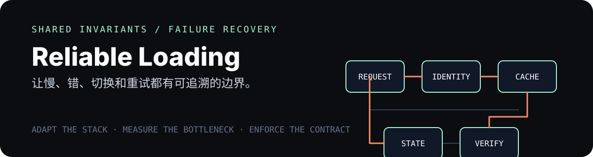

# Reliable Loading Lifecycle Skill

A Codex skill for auditing and implementing resilient loading behavior across web applications without forcing one framework-specific solution.

It covers shared request transport, cache identity, cancellation, loading/error/refresh states, mutation safety, long jobs, and CI enforcement. The skill first inspects the target stack, then chooses the smallest suitable adapter.

<p align="center">
  
</p>

## Scope

Use it when a page can go blank, show stale data, duplicate requests, lose cancellation, or retry a consequential write unsafely. It adapts to the existing stack; it does not promise faster backend responses or replace measurement of the actual bottleneck.

## Install

```bash
git clone https://github.com/dongV-x/reliable-loading-lifecycle-skill.git ~/.codex/skills/reliable-loading-lifecycle
```

If `~/.codex/skills` is managed elsewhere, clone or link this repository as a direct child of the active skills directory.

## Use

```text
Use $reliable-loading-lifecycle to determine whether this project's loading problem is fully, partly, or not primarily a lifecycle problem, then implement the smallest suitable shared mechanism. Cover in-scope existing and future pages, add enforceable CI checks, run a local negative bypass probe, and report remaining limits honestly. Do not push probes or change repository policy without my explicit authorization.
```

The skill does not assume React, TanStack Query, or any specific backend. It adapts to the project's installed stack and does not authorize production changes, merges, deployments, or repository-policy changes.

## Origin

The contract was distilled from a production-oriented migration covering route queries, tables, modals, searches, mutations, background work, file flows, authenticated cache isolation, and CI bypass testing. Framework-specific source code is intentionally not embedded in the skill.

## License

MIT
